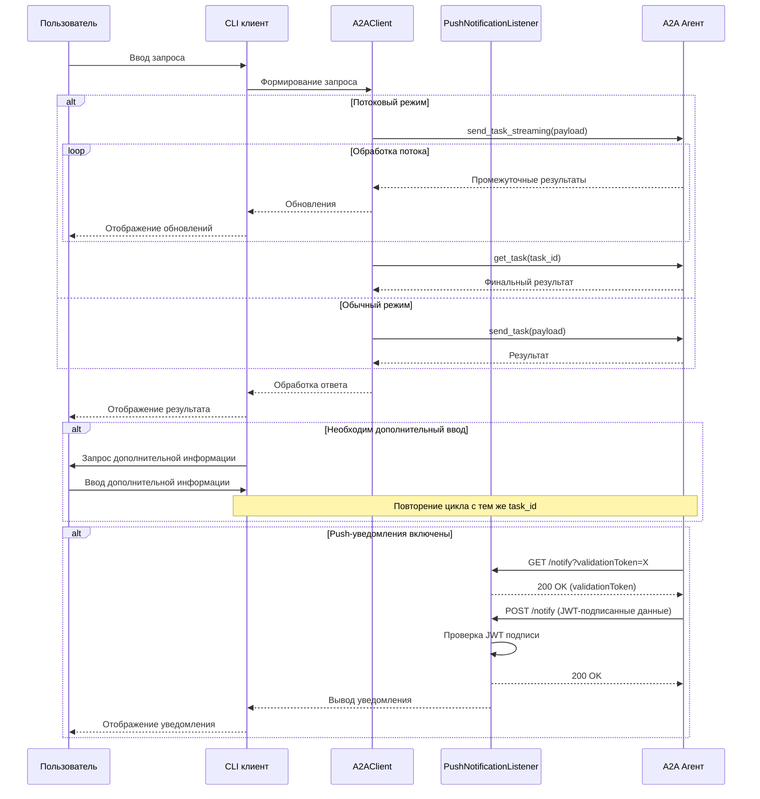
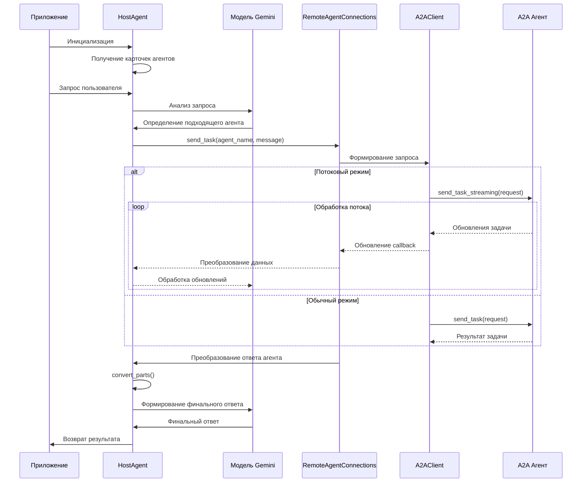

# Техническая документация A2A клиентов

<div align="center">


</div>

## 📑 Содержание

- [Обзор кодовой базы](#-обзор-кодовой-базы)
- [CLI клиент](#-cli-клиент)
  - [Основные компоненты](#основные-компоненты)
  - [Функции и классы](#функции-и-классы)
  - [Обработка запросов и ответов](#обработка-запросов-и-ответов)
  - [Push-уведомления](#push-уведомления)
- [Мультиагентный оркестратор](#-мультиагентный-оркестратор)
  - [Ключевые компоненты](#ключевые-компоненты)
  - [HostAgent: основной класс](#hostagent-основной-класс)
  - [Механизм делегирования задач](#механизм-делегирования-задач)
  - [Обработка метаданных](#обработка-метаданных)
- [Потоки данных](#-потоки-данных)
  - [CLI клиент](#поток-данных-cli-клиента)
  - [Multi-Agent оркестратор](#поток-данных-multi-agent-оркестратора)
- [Примеры интеграции](#-примеры-интеграции)

## 🔍 Обзор кодовой базы

Кодовая база A2A клиентов состоит из двух основных компонентов:

1. **CLI клиент** (`hosts/cli/`) - интерактивный терминальный интерфейс для взаимодействия с A2A серверами:
   - `__main__.py` - точка входа и основная логика взаимодействия
   - `push_notification_listener.py` - обработка асинхронных push-уведомлений

2. **Multi-Agent оркестратор** (`hosts/multiagent/`) - интеллектуальный координатор для работы с несколькими агентами:
   - `agent.py` - инициализация корневого агента
   - `host_agent.py` - основная логика выбора агентов и делегирования задач
   - `remote_agent_connection.py` - интерфейс для взаимодействия с удаленными агентами

Оба клиента используют базовые компоненты из библиотеки `common`, в частности:
- `A2AClient` - клиент для взаимодействия с A2A API
- `A2ACardResolver` - получение метаданных агента (AgentCard)
- `PushNotificationReceiverAuth` - проверка подлинности push-уведомлений
- Модели данных из `common.types` для формирования запросов и обработки ответов

## 💻 CLI клиент

CLI клиент представляет собой асинхронное консольное приложение для прямого взаимодействия с A2A агентами. Он демонстрирует как базовый режим запрос-ответ, так и более продвинутые возможности, такие как потоковая передача данных и получение push-уведомлений.

### Основные компоненты

```python
# Инициализация клиента и взаимодействие с агентом
@click.command()
async def cli(agent, session, history, use_push_notifications, push_notification_receiver):
    # Получение карточки агента
    card_resolver = A2ACardResolver(agent)
    card = card_resolver.get_agent_card()
    
    # Запуск слушателя push-уведомлений (опционально)
    if use_push_notifications:
        push_notification_listener = PushNotificationListener(...)
        push_notification_listener.start()
        
    # Инициализация клиента и сессии
    client = A2AClient(agent_card=card)
    session_id = uuid4().hex if session == 0 else str(session)
    
    # Основной цикл взаимодействия
    while continue_loop:
        continue_loop = await complete_task(...)
```

### Функции и классы

#### 1. `cli()`
Основная точка входа, обрабатывает аргументы командной строки и инициализирует компоненты:
- Получает карточку агента через `A2ACardResolver`
- Запускает слушатель push-уведомлений при необходимости
- Управляет циклом взаимодействия с агентом

```python
@click.command()
@click.option("--agent", default="http://localhost:10000", help="URL агента для взаимодействия")
@click.option("--session", default=0, help="ID сессии (0 = создать новую)")
@click.option("--history", default=False, help="Показывать историю сообщений")
@click.option("--use_push_notifications", default=False, help="Использовать push-уведомления")
@click.option(
    "--push_notification_receiver", 
    default="http://localhost:5000", 
    help="URL для получения push-уведомлений"
)
async def cli(...):
    # Реализация
```

#### 2. `complete_task()`
Обрабатывает отдельное задание в рамках диалога:
- Запрашивает ввод пользователя
- Формирует параметры запроса
- Отправляет запрос в потоковом или обычном режиме
- Обрабатывает результаты и определяет необходимость продолжения диалога

```python
async def complete_task(
    client: A2AClient, 
    streaming: bool, 
    use_push_notifications: bool, 
    notification_receiver_host: str, 
    notification_receiver_port: int, 
    task_id: str, 
    session_id: str
) -> bool:
    # Запрашиваем ввод пользователя
    prompt = click.prompt("\nWhat do you want to send to the agent? (:q or quit to exit)")
    
    # Формируем и отправляем запрос
    # ...
    
    # Обрабатываем ответ
    # ...
    
    # Проверяем необходимость дополнительного ввода
    state = TaskState(task_result.result.status.state)
    if state.name == TaskState.INPUT_REQUIRED.name:
        # Рекурсивный вызов для продолжения диалога
        return await complete_task(...)
    else:
        # Завершение задания
        return True
```

#### 3. `PushNotificationListener`
Класс для обработки асинхронных уведомлений от A2A агента:
- Запускает HTTP-сервер в отдельном потоке
- Обрабатывает валидационные запросы (GET)
- Принимает и верифицирует push-уведомления (POST)
- Использует JWT для аутентификации уведомлений

```python
class PushNotificationListener:
    def __init__(
        self, 
        host: str, 
        port: int, 
        notification_receiver_auth: PushNotificationReceiverAuth
    ) -> None:
        # Инициализация параметров
        
    def start(self) -> None:
        # Запуск сервера в отдельном потоке
        
    async def start_server(self) -> None:
        # Асинхронный запуск HTTP-сервера
        
    async def handle_validation_check(self, request: Request) -> Response:
        # Обработка GET-запросов для валидации токена
        
    async def handle_notification(self, request: Request) -> Response:
        # Обработка POST-запросов с уведомлениями
```

### Обработка запросов и ответов

Взаимодействие с A2A агентом происходит в функции `complete_task()`:

1. **Формирование запроса**:
```python
payload = {
    "id": task_id,
    "sessionId": session_id,
    "acceptedOutputModes": ["text"],
    "message": {
        "role": "user",
        "parts": [
            {
                "type": "text",
                "text": prompt,
            }
        ],
    },
}

# Добавление настроек push-уведомлений при необходимости
if use_push_notifications:
    payload["pushNotification"] = {
        "url": f"http://{notification_receiver_host}:{notification_receiver_port}/notify",
        "authentication": {
            "schemes": ["bearer"],
        },
    }
```

2. **Отправка запроса** (два режима):
```python
# Потоковый режим (streaming)
if streaming:
    response_stream = client.send_task_streaming(payload)
    async for result in response_stream:
        print(f"stream event => {result.model_dump_json(exclude_none=True)}")
    task_result = await client.get_task({"id": task_id})
# Обычный режим
else:
    task_result = await client.send_task(payload)
    print(f"\n{task_result.model_dump_json(exclude_none=True)}")
```

3. **Обработка ответа**:
```python
# Проверка состояния задания
state = TaskState(task_result.result.status.state)
if state.name == TaskState.INPUT_REQUIRED.name:
    # Рекурсивный вызов для продолжения диалога
    return await complete_task(...)
else:
    # Завершение задания
    return True
```

### Push-уведомления

CLI клиент поддерживает получение асинхронных push-уведомлений от агента, что позволяет получать обновления о статусе задачи, даже если клиент не отправляет активных запросов.

1. **Настройка слушателя**:
```python
if use_push_notifications:
    from hosts.cli.push_notification_listener import PushNotificationListener
    notification_receiver_auth = PushNotificationReceiverAuth()
    await notification_receiver_auth.load_jwks(f"{agent}/.well-known/jwks.json")

    push_notification_listener = PushNotificationListener(
        host=notification_receiver_host,
        port=notification_receiver_port,
        notification_receiver_auth=notification_receiver_auth,
    )
    push_notification_listener.start()
```

2. **Обработка уведомлений**:
```python
async def handle_notification(self, request: Request) -> Response:
    data = await request.json()
    try:
        # Проверка подлинности уведомления через JWT
        if not await self.notification_receiver_auth.verify_push_notification(request):
            print("push notification verification failed")
            return Response(status_code=401)
    except Exception as e:
        print(f"error verifying push notification: {e}")
        print(traceback.format_exc())
        return Response(status_code=500)
        
    print(f"\npush notification received => \n{data}\n")
    return Response(status_code=200)
```

3. **Проверка валидационного токена**:
```python
async def handle_validation_check(self, request: Request) -> Response:
    validation_token = request.query_params.get("validationToken")
    print(f"\npush notification verification received => \n{validation_token}\n")

    if not validation_token:
        return Response(status_code=400)
        
    return Response(content=validation_token, status_code=200)
```

## 🔄 Мультиагентный оркестратор

Мультиагентный оркестратор - это интеллектуальный посредник, реализованный на базе Google ADK, который маршрутизирует запросы пользователя к подходящим удаленным агентам на основе их возможностей.

### Ключевые компоненты

```python
# agent.py - инициализация корневого агента
root_agent = HostAgent(
    remote_agent_addresses=["http://localhost:10000"]
).create_agent()

# host_agent.py - основная логика взаимодействия с агентами
class HostAgent:
    def __init__(self, remote_agent_addresses: List[str], task_callback: Optional[TaskUpdateCallback] = None):
        # Устанавливаем соединения с удаленными агентами
        # ...
        
    def create_agent(self) -> Agent:
        # Создаем агента Google ADK
        # ...
        
    async def send_task(self, agent_name: str, message: str, tool_context: ToolContext):
        # Отправляем задачу выбранному агенту
        # ...

# remote_agent_connection.py - обертка для A2AClient
class RemoteAgentConnections:
    def __init__(self, agent_card: AgentCard):
        # Инициализируем клиент для агента
        # ...
        
    async def send_task(self, request: TaskSendParams, task_callback: Optional[TaskUpdateCallback] = None):
        # Отправляем задачу агенту в соответствующем режиме
        # ...
```

### HostAgent: основной класс

`HostAgent` - центральный компонент Multi-Agent оркестратора, отвечающий за:
- Установку соединений с удаленными агентами
- Создание и настройку агента Google ADK
- Предоставление инструментов для выбора и взаимодействия с агентами
- Преобразование данных между форматами A2A и Google ADK

```python
class HostAgent:
    def __init__(self, remote_agent_addresses: List[str], task_callback: Optional[TaskUpdateCallback] = None):
        self.task_callback = task_callback
        self.remote_agent_connections: Dict[str, RemoteAgentConnections] = {}
        self.cards: Dict[str, AgentCard] = {}
        
        # Устанавливаем соединения со всеми удаленными агентами
        for address in remote_agent_addresses:
            card_resolver = A2ACardResolver(address)
            card = card_resolver.get_agent_card()
            remote_connection = RemoteAgentConnections(card)
            self.remote_agent_connections[card.name] = remote_connection
            self.cards[card.name] = card
            
        # Формируем информацию о доступных агентах для инструкции
        agent_info = []
        for ra in self.list_remote_agents():
            agent_info.append(json.dumps(ra))
        self.agents = '\n'.join(agent_info)
```

Ключевой метод `create_agent()` создает экземпляр Google ADK агента:

```python
def create_agent(self) -> Agent:
    return Agent(
        model="gemini-2.0-flash-001",
        name="host_agent",
        instruction=self.root_instruction,
        before_model_callback=self.before_model_callback,
        description=(
            "This agent orchestrates the decomposition of the user request into"
            " tasks that can be performed by the child agents."
        ),
        tools=[
            self.list_remote_agents,
            self.send_task,
        ],
    )
```

### Механизм делегирования задач

Основной функционал для делегирования задач реализован в методе `send_task()`:

```python
async def send_task(
        self,
        agent_name: str,
        message: str,
        tool_context: ToolContext) -> List[Union[str, Dict[str, Any]]]:
    # Проверяем наличие агента
    if agent_name not in self.remote_agent_connections:
        raise ValueError(f"Agent {agent_name} not found")
        
    # Обновляем состояние
    state = tool_context.state
    state['agent'] = agent_name
    
    # Получаем карточку и клиент агента
    card = self.cards[agent_name]
    client = self.remote_agent_connections[agent_name]
    
    # Формируем запрос
    request: TaskSendParams = TaskSendParams(
        id=task_id,
        sessionId=session_id,
        message=Message(
            role="user",
            parts=[TextPart(text=message)],
            metadata=metadata,
        ),
        acceptedOutputModes=["text", "text/plain", "image/png"],
        metadata={'conversation_id': session_id},
    )
    
    # Отправляем задачу
    task = await client.send_task(request, self.task_callback)
    
    # Обрабатываем ответ
    response = []
    if task.status.message:
        response.extend(convert_parts(task.status.message.parts, tool_context))
    if task.artifacts:
        for artifact in task.artifacts:
            response.extend(convert_parts(artifact.parts, tool_context))
            
    return response
```

Важной частью является преобразование форматов данных между A2A и Google ADK:

```python
def convert_parts(parts: List[Part], tool_context: ToolContext) -> List[Union[str, Dict[str, Any]]]:
    rval = []
    for p in parts:
        rval.append(convert_part(p, tool_context))
    return rval

def convert_part(part: Part, tool_context: ToolContext) -> Union[str, Dict[str, Any]]:
    if part.type == "text":
        return part.text
    elif part.type == "data":
        return part.data
    elif part.type == "file":
        # Перепаковываем A2A FilePart в google.genai Blob
        file_id = part.file.name
        file_bytes = base64.b64decode(part.file.bytes)    
        file_part = types.Part(
            inline_data=types.Blob(
                mime_type=part.file.mimeType,
                data=file_bytes
            )
        )
        tool_context.save_artifact(file_id, file_part)
        tool_context.actions.skip_summarization = True
        tool_context.actions.escalate = True
        return DataPart(data={"artifact-file-id": file_id})
    return f"Unknown type: {part.type}"
```

### Обработка метаданных

Для сохранения контекста между запросами используется обмен метаданными:

```python
def merge_metadata(target: Any, source: Any) -> None:
    # Проверяем наличие атрибутов metadata у обоих объектов
    if not hasattr(target, 'metadata') or not hasattr(source, 'metadata'):
        return
        
    # Если оба объекта имеют метаданные, объединяем их
    if target.metadata and source.metadata:
        target.metadata.update(source.metadata)
    # Если только источник имеет метаданные, копируем их в цель
    elif source.metadata:
        target.metadata = dict(**source.metadata)
```

В `RemoteAgentConnections` метаданные используются для:
- Сохранения идентификаторов сообщений и диалогов
- Связывания запросов и ответов
- Передачи дополнительного контекста между запросами

```python
# Обрабатываем метаданные сообщений в обновлениях статуса
if (hasattr(response.result, 'status') and
        hasattr(response.result.status, 'message') and
        response.result.status.message):
    merge_metadata(response.result.status.message, request.message)
    message = response.result.status.message
    
    # Инициализируем метаданные, если их нет
    if not message.metadata:
        message.metadata = {}
        
    # Сохраняем предыдущий идентификатор сообщения
    if 'message_id' in message.metadata:
        message.metadata['last_message_id'] = message.metadata['message_id']
        
    # Генерируем новый идентификатор сообщения
    message.metadata['message_id'] = str(uuid.uuid4())
```

## 🔄 Потоки данных

### Поток данных CLI клиента



### Поток данных Multi-Agent оркестратора



## 💡 Примеры интеграции

### Использование CLI клиента

```bash
# Базовое использование с локальным агентом
python -m hosts.cli --agent http://localhost:10000

# Использование с push-уведомлениями
python -m hosts.cli --agent http://localhost:10000 --use_push_notifications

# Продолжение существующей сессии с отображением истории
python -m hosts.cli --agent http://localhost:10000 --session abcdef123456 --history
```

### Интеграция Multi-Agent оркестратора в приложение

```python
# Импорт корневого агента
from hosts.multiagent.agent import root_agent

# Пример создания собственного агента с дополнительными адресами
from hosts.multiagent.host_agent import HostAgent

custom_host_agent = HostAgent(
    remote_agent_addresses=[
        "http://localhost:10000",
        "http://localhost:10001",
        "http://localhost:10002"
    ]
).create_agent()

# Использование агента для обработки запроса
async def process_user_request(user_message, user_id, session_id):
    content = types.Content(
        role="user", 
        parts=[types.Part.from_text(text=user_message)]
    )
    
    # Выполнение запроса и получение результатов
    events = root_agent.run(
        user_id=user_id,
        session_id=session_id,
        new_message=content
    )
    
    # Обработка результатов
    for event in events:
        if event.content and event.content.parts:
            responses = [p.text for p in event.content.parts if p.text]
            return "\n".join(responses)
    
    return "Нет ответа от агента"
```

### Расширение возможностей CLI клиента

```python
# Пример добавления новой опции CLI
@click.command()
@click.option("--agent", default="http://localhost:10000", help="URL агента")
@click.option("--debug", default=False, help="Включить отладочный режим")
@click.option("--timeout", default=30, help="Таймаут запросов в секундах")
async def extended_cli(agent: str, debug: bool, timeout: int):
    # Код инициализации
    
    # Настройка дополнительных параметров
    if debug:
        logging.basicConfig(level=logging.DEBUG)
    
    # Создание клиента с таймаутом
    client = A2AClient(agent_card=card, timeout=timeout)
    
    # Основной цикл
    # ...
```

### Добавление поддержки новых типов контента

```python
# Расширение функции convert_part для поддержки новых типов
def extended_convert_part(part: Part, tool_context: ToolContext) -> Union[str, Dict[str, Any]]:
    if part.type == "text":
        return part.text
    elif part.type == "data":
        return part.data
    elif part.type == "file":
        # Стандартная обработка файлов
        # ...
    elif part.type == "audio":
        # Обработка аудио-контента
        audio_id = f"audio_{uuid.uuid4().hex}"
        audio_bytes = base64.b64decode(part.audio.bytes)
        audio_part = types.Part(
            inline_data=types.Blob(
                mime_type=part.audio.mimeType,
                data=audio_bytes
            )
        )
        tool_context.save_artifact(audio_id, audio_part)
        return DataPart(data={"artifact-audio-id": audio_id})
    return f"Unknown type: {part.type}"
```