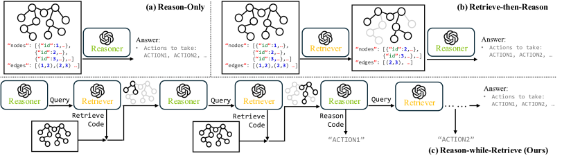

# Schema Guided Reasoning (SGR) и SG²: структурированные рассуждения и мультиагентные сцены 🚀

[](https://arxiv.org/abs/2502.03450)
[](https://t.me/TheWeeklyBrief)

## 📝 Описание

На этой неделе рассматриваем подход **Schema Guided Reasoning (SGR)** — метод структурированного промптинга, который направляет рассуждения LLM через типизированные схемы и явные рабочие процессы. Также разбираем расширение для пространственного рассуждения — **SG² (Schema-Guided Scene-Graph Reasoning)**, многоагентный фреймворк «рассуждай-пока-извлекаешь» для задач по графам сцены. Подходы демонстрируют прирост точности на 5–10% и достигают 95%+ воспроизводимости, одновременно снижая галлюцинации за счёт валидации схем и программного извлечения фактов.

## 🔍 Ключевые особенности

- **Структурированные выводы**: типизированные схемы (JSON Schema / Pydantic) обеспечивают контроль формата и смысла ответа.
- **Три паттерна рассуждения**: Cascade, Routing, Cycle — для разных типов задач и контроля шага рассуждений.
- **Constrained decoding**: CFG/grammar-ограничения для безопасной генерации, автоматические повторы при валидации.
- **Мультиагентная архитектура SG²**: разделение на модуль рассуждений и модуль извлечения с программным доступом к графу.
- **Программное извлечение**: генерация Python-кода для обхода scene-graph вместо жёстких API.
- **Снижение галлюцинаций**: разделение контекста и схема-навигация уменьшают отвлечения и ошибочные выводы.
- **Совместимость**: OpenAI Structured Outputs, Instructor, LangChain, Pydantic AI, локальные бэкенды (xgrammar/Outlines/etc.).

## 📈 Результаты и сравнения

| Характеристика | SGR | CoT | ReAct | ToT | Plan-and-Solve |
|---|---|---|---|---|---|
| Воспроизводимость | 95%+ | 70–85% | 60–80% | 50–70% | 75–85% |
| Структурированность | Жёсткая (схемы) | Свободная (промпт) | Цикличная | Деревья | Двухфазная |
| GSM8K (ориентир) | 85–92% | 40–58% | 65–75% | ~74% | 78–82% |
| Тех. сложность | 5/10 | 2/10 | 6/10 | 9/10 | 3/10 |

В экспериментах SG² превосходит базы: в BabyAI достигает до **98%** в числовых задачах (против ~86% у ReAct), в планировании — **96–97%**. Даже с малыми моделями (например, Phi4‑14B) сохраняется преимущество: **~60%** против <30% у базовых подходов.

## 🧠 Архитектура SG² кратко

- **Планировщик задач**: формирует запросы к извлечению, координирует ход решения.
- **Вызов инструментов/кодоген**: генерирует исполняемый Python для обхода графа сцены.
- **Верификатор**: проверяет, что извлечённые факты удовлетворяют запросу/схеме.
- **Сцена как схема**: типы узлов, атрибуты и рёбра направляют и рассуждение, и извлечение.




## 🌟 Практические применения

- Пространственное планирование и навигация (робототехника, VirtualHome, симуляции).
- Извлечение структурированных фактов из сложных сред и больших графов.
- Enterprise‑кейсы: аудируемые пайплайны reasoning с контролем качества, соответствие требованиям compliance.

## 🔗 Ссылки

- Обзор недели: 
- Краткое резюме: [`summary.md`](https://github.com/Verbasik/Weekly-arXiv-ML-AI-Research-Review/blob/develop/2025/week-36/summary.md)
- Публикация: [arXiv:2502.03450](https://arxiv.org/abs/2502.03450)
- Инструменты: Instructor, OpenAI Structured Outputs, LangChain, Pydantic AI

## 📜 Цитирование

```bibtex
@misc{sgr_scene_graph_2025,
  title={Schema-Guided Scene-Graph Reasoning based on Multi-Agent Large Language Model System},
  year={2025},
  eprint={2502.03450},
  archivePrefix={arXiv},
  primaryClass={cs.AI}
}
```

---

<p align="center">Исследуйте вместе с нами 🚀</p>


