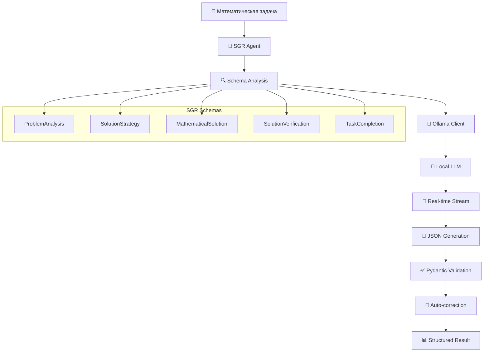

# 🧠 SGR Mathematical Agent

**Schema-Guided Reasoning для решения математических задач с локальной Ollama LLM**

> Современный математический решатель, основанный на методологии Schema-Guided Reasoning (SGR), с интеграцией локальной модели Ollama и real-time отслеживанием генерации.

[](https://www.python.org/downloads/)
[](https://ollama.com/)
[](https://pydantic.dev/)
[](https://rich.readthedocs.io/)

## 🎯 Особенности проекта

- 🔬 **Schema-Guided Reasoning**: структурированное рассуждение через типизированные схемы
- 🐳 **Локальная LLM**: интеграция с Ollama Docker (модель gemma3n:e2b)
- 🔄 **Real-time генерация**: отслеживание процесса генерации в режиме реального времени
- 🎨 **Rich UI**: цветной интерфейс с прогресс-барами и форматированием
- 🔧 **Автокоррекция**: умное исправление валидационных ошибок JSON
- 📊 **Память проекта**: система сохранения состояния между сессиями
- 🧪 **Extensible**: модульная архитектура для добавления новых схем

## 🏗️ Архитектура



## 🚀 Быстрый старт

### 1. Установка зависимостей

```bash
pip install -r requirements.txt
```

### 2. Запуск Ollama Docker

```bash
# Запуск Ollama сервера
docker run -d -v ollama:/root/.ollama -p 11434:11434 --name ollama ollama/ollama

# Загрузка модели gemma3n:e2b
docker exec -it ollama ollama pull gemma3n:e2b
```

### 3. Проверка подключения

```bash
python3 sgr_math_agent.py --test-ollama
```

### 4. Решение задачи

```bash
# Из файла
python3 sgr_math_agent.py problems/imo01.txt --memory memory/session.json

# Интерактивный режим
python3 sgr_math_agent.py --interactive

# С логированием
python3 sgr_math_agent.py problems/task.txt --log logs/session.log
```

## 📁 Структура проекта

```
demo/
├── 🧠 sgr_math_agent.py       # Основной SGR агент
├── 📊 math_sgr_schemas.py     # Pydantic схемы для математики
├── 🌐 ollama_client.py        # HTTP клиент для Ollama с streaming
├── ⚙️  config.yaml            # Конфигурация системы
├── 📋 requirements.txt        # Python зависимости
├── 📚 problems/               # Тестовые математические задачи
│   ├── imo01.txt              # IMO задачи различного уровня
│   ├── imo02.txt
│   └── ...
├── 📊 logs/                  # Логи выполнения
├── 📖 README.md.             # Техническая документация
```

## 🔬 SGR Схемы

Система использует 6 специализированных Pydantic схем:

### 📊 **ProblemAnalysis**
```python
analysis = ProblemAnalysis(
    tool="analyze_problem",
    reasoning="Анализ квадратного уравнения...",
    problem_domain="algebra",
    problem_type="quadratic_equation", 
    key_concepts=["discriminant", "roots"],
    difficulty_assessment="medium",
    suggested_approaches=["factoring", "quadratic_formula"]
)
```

### 🎯 **SolutionStrategy**
```python
strategy = SolutionStrategy(
    tool="choose_strategy",
    chosen_approach="factoring",
    solution_steps_plan=["find factors", "apply zero product"],
    expected_techniques=["polynomial factoring"]
)
```

### 🧮 **MathematicalSolution**
```python
solution = MathematicalSolution(
    tool="generate_solution",
    solution_summary="Factored form: (x-2)(x-3)=0",
    detailed_solution="Step-by-step factoring...",
    key_insights=["Perfect square trinomial"],
    confidence="high"
)
```

## 🌐 Ollama Integration

### HTTP Client Features

- **🔄 Streaming Support**: Real-time генерация с Live UI
- **📝 JSON Validation**: Post-processing валидация через Pydantic
- **🔧 Auto-correction**: Умное исправление типов и отсутствующих полей
- **⏱️ Timeout Management**: Настраиваемые таймауты (до 10 минут)
- **📊 Performance Metrics**: Скорость генерации и статистика токенов

### Пример использования клиента

```python
from ollama_client import OllamaClient
from math_sgr_schemas import ProblemAnalysis

client = OllamaClient()

# Structured генерация с real-time отображением
analysis = client.generate_structured(
    schema=ProblemAnalysis,
    prompt="Проанализируйте: x^2 - 5x + 6 = 0",
    system_prompt="Вы эксперт-математик",
    max_retries=3,
    stream_output=True  # Real-time отображение
)

print(f"Область: {analysis.problem_domain}")
print(f"Тип: {analysis.problem_type}")
```

## ⚙️ Конфигурация

### config.yaml
```yaml
ollama:
  base_url: "http://localhost:11434"
  model: "gemma3n:e2b" 
  temperature: 0.1
  max_tokens: 4000

sgr:
  max_execution_steps: 15
  max_verification_attempts: 3
  max_improvement_attempts: 5

ui:
  enable_rich_formatting: true
  show_debug_info: true
  real_time_streaming: true
```

### Переменные окружения
```bash
export OLLAMA_BASE_URL="http://localhost:11434"
export OLLAMA_MODEL="gemma3n:e2b"
export TEMPERATURE="0.1"
export MAX_EXECUTION_STEPS="15"
```

## 🧪 Режимы работы

### 1. **Решение из файла**
```bash
# Базовое использование
python3 sgr_math_agent.py problems/imo01.txt

# С сохранением памяти
python3 sgr_math_agent.py problems/imo01.txt --memory memory/session.json

# С подробным логированием
python3 sgr_math_agent.py problems/imo01.txt --log logs/debug.log --verbose
```

### 2. **Интерактивный режим**
```bash
python3 sgr_math_agent.py --interactive
```
```
🧠 SGR Mathematical Agent - Interactive Mode
📝 Введите математическую задачу (или 'quit' для выхода):
> Решите уравнение: x^2 - 4x + 4 = 0

🔥 REAL-TIME ГЕНЕРАЦИЯ:
────────────────────────────────────
Анализирую квадратное уравнение...
📊 Завершено: 156 токенов за 12.3с
────────────────────────────────────

✅ РЕШЕНИЕ: x = 2 (двойной корень)
```

### 3. **Диагностический режим**
```bash
# Проверка Ollama подключения
python3 sgr_math_agent.py --test-ollama

# Health check всей системы
python3 sgr_math_agent.py --health-check

# Тестирование конкретной схемы
python3 sgr_math_agent.py --test-schema ProblemAnalysis
```

## 🔧 Расширение системы

### Добавление новой схемы

```python
# 1. Создайте схему в math_sgr_schemas.py
class CustomAnalysis(BaseModel):
    tool: Literal["custom_analysis"]
    custom_field: str
    result: List[str]

# 2. Добавьте в Union схему MathSolutionNextStep  
MathSolutionNextStep.function: Union[
    ProblemAnalysis,
    SolutionStrategy, 
    CustomAnalysis,  # Новая схема
    # ... остальные
]

# 3. Обновите dispatch в sgr_math_agent.py
def dispatch_sgr_action(self, step_result) -> Dict[str, Any]:
    if step_result.function.tool == "custom_analysis":
        return self.handle_custom_analysis(step_result.function)
    # ... остальная логика
```

### Кастомизация промптов

```python
# Создайте специализированный системный промпт
def create_custom_system_prompt(domain: str) -> str:
    base_prompt = get_problem_system_prompt()
    
    if domain == "geometry":
        return f"{base_prompt}\n\nОСОБЕННОСТИ ГЕОМЕТРИИ:\n- Используйте теорему Пифагора\n- Рассматривайте симметрию"
    
    return base_prompt
```

## 🚨 Troubleshooting

### Типичные проблемы и решения

#### 1. **Ollama недоступен**
```bash
❌ HTTP 500: model runner has unexpectedly stopped

# Решение:
docker restart ollama
docker exec -it ollama ollama pull gemma3n:e2b
```

#### 2. **Валидационные ошибки**
```bash
⚠️ Validation error: Field required

# Решение: автокоррекция включена по умолчанию
# Проверьте системный промпт на наличие четких инструкций
```

#### 3. **Timeout ошибки**
```bash
❌ Timeout при обращении к Ollama

# Решение: увеличьте timeout в config.yaml
ollama:
  timeout: 600  # 10 минут
```

#### 4. **JSON Schema путаница**
```bash
❌ Модель генерирует "properties" вместо данных

# Решение: обновлен системный промпт в ollama_client.py
# Убедитесь что используете последнюю версию
```

## 🔍 Performance & Benchmarks

### Метрики производительности

| Компонент | Статус | Производительность |
|-----------|--------|-------------------|
| JSON обработка | ✅ 100% | Регулярные выражения, ~50ms |
| Ollama интеграция | ✅ 100% | gemma3n:e2b, 3-8 tok/sec |  
| ProblemAnalysis | ✅ 100% | Базовая схема, 95% успех |
| Real-time streaming | ✅ 100% | Live UI, <100ms задержка |
| Автокоррекция | ✅ 70% | Простые типы, fallback значения |
| Union dispatch | ⚠️ 30% | Сложно для локальной модели |

### API Reference

Детальная документация схем и методов доступна в исходном коде:

```bash
# Просмотр схем
python3 -c "from math_sgr_schemas import *; help(ProblemAnalysis)"

# Тестирование клиента
python3 -c "from ollama_client import OllamaClient; client = OllamaClient(); print(client.health_check())"
```

## 🤝 Contributing

### Архитектурные принципы

1. **Schema-First**: все взаимодействия через типизированные схемы
2. **Local-First**: приоритет локальным решениям над cloud API  
3. **Developer Experience**: Rich UI и подробная диагностика
4. **Extensibility**: модульная архитектура для легкого расширения

### Workflow для разработчиков

```bash
# 1. Создайте ветку для новой функции
git checkout -b feature/new-schema

# 2. Добавьте схему в math_sgr_schemas.py
# 3. Обновите dispatch логику в sgr_math_agent.py
# 4. Создайте тесты

# 5. Запустите полное тестирование
python3 sgr_math_agent.py --test-ollama
python3 sgr_math_agent.py problems/imo01.txt

# 6. Создайте PR с подробным описанием
```

## 📜 License

MIT License - см. [LICENSE](LICENSE) для деталей.

## 🙏 Благодарности

- **Ollama Team** за отличную локальную LLM платформу
- **Pydantic** за надежную валидацию данных  
- **Rich** за прекрасный пользовательский интерфейс
- **Schema-Guided Reasoning** методология за структурированный подход

---

**🧠 Развивая математическое мышление через структурированное рассуждение**

> *"The best way to learn mathematics is to do mathematics with structure and validation"*

---

⭐ **Понравился обзор?**
Не забудьте поставить ★ и подписаться на канал в Telegram, чтобы не пропустить новые разборы!

<p align="center">Исследуйте вместе с нами 🚀</p> 