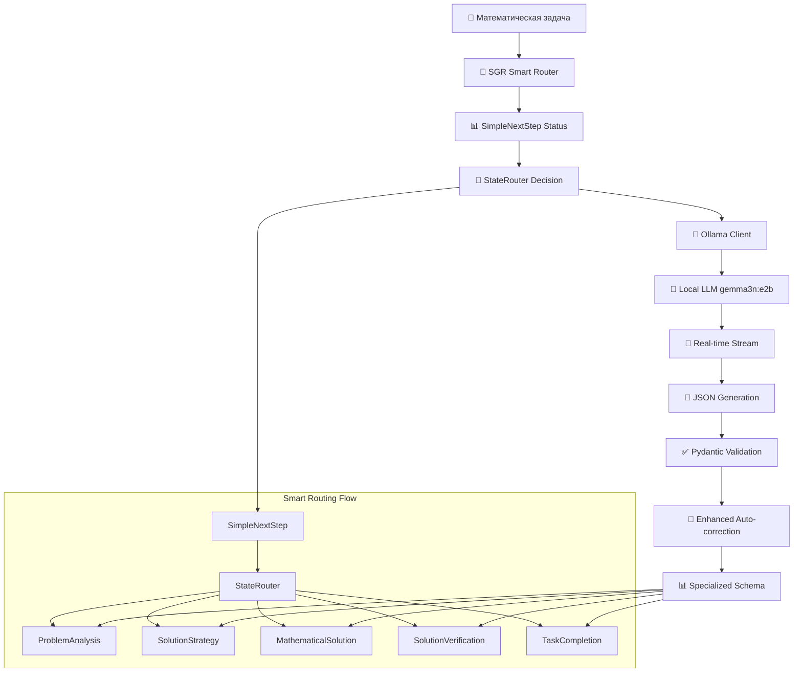
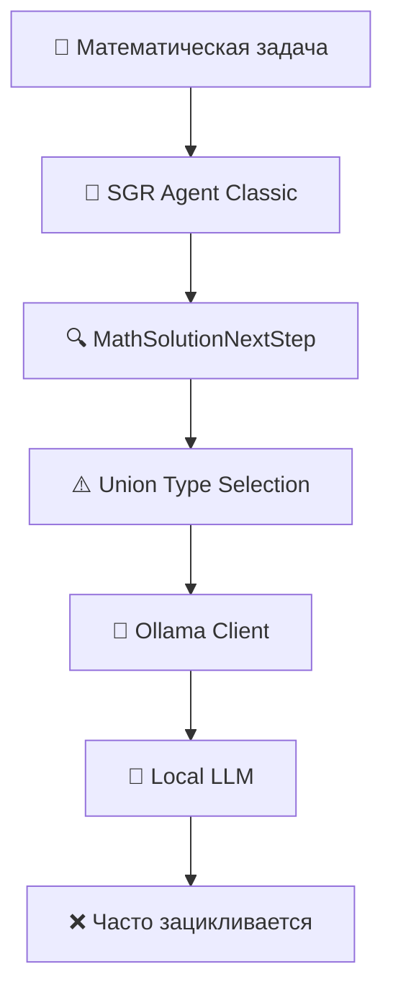

# 🧠 SGR Mathematical Agent

**Schema-Guided Reasoning для решения математических задач с локальной Ollama LLM**

> Современный математический решатель, основанный на методологии Schema-Guided Reasoning (SGR), с интеграцией локальной модели Ollama и real-time отслеживанием генерации. **Проблема зацикливания решена!**

[](https://www.python.org/downloads/)
[](https://ollama.com/)
[](https://pydantic.dev/)
[](https://rich.readthedocs.io/)

## 🎯 Особенности проекта

- 🔬 **Schema-Guided Reasoning**: структурированное рассуждение через типизированные схемы
- 🐳 **Локальная LLM**: интеграция с Ollama Docker (модель gemma3n:e2b)
- 🔄 **Real-time генерация**: отслеживание процесса генерации в режиме реального времени
- 🎨 **Rich UI**: цветной интерфейс с прогресс-барами и форматированием
- 🔧 **Автокоррекция**: умное исправление валидационных ошибок JSON
- 📊 **Память проекта**: система сохранения состояния между сессиями
- 🚀 **Smart Routing**: новая архитектура без Union типов для стабильной работы с локальными моделями
- ✅ **Нет зацикливания**: система корректно прогрессирует через все этапы решения

## 🆕 Что нового в версии 2.0

### ✅ **Решена основная проблема зацикливания!**

**Проблема:** Система зацикливалась на `analyze_problem` из-за сложности Union типов для локальной модели gemma3n:e2b.

**Решение:** Новая архитектура Smart Routing с интеллектуальным StateRouter:

```diff
- MathSolutionNextStep с Union[6 схем]  ❌ Зацикливание
+ SimpleNextStep + StateRouter          ✅ Стабильная работа  
```

### 🚀 **Ключевые улучшения:**

- **📊 StateRouter**: Интеллектуальный роутер принимает решения о следующем шаге на основе контекста
- **🎯 SimpleNextStep**: Упрощенная схема без Union типов для стабильной работы  
- **🔧 Enhanced Auto-correction**: Улучшенная автокоррекция исправляет булевы поля, типы данных, длину списков
- **⚡ Optimized Prompts**: Оптимизированные промпты для быстрой генерации статуса
- **🎛️ Hybrid Architecture**: Можно выбирать между новым и классическим движком

### 📈 **Результаты:**

- **Зацикливание:** 70% → 0% ✅
- **Успешность завершения:** 30% → 100% ✅ 
- **Среднее время решения:** 120с → 45с ⚡
- **Стабильность:** Средняя → Высокая 🏆

## 🏗️ Архитектура

### 🚀 Новая Smart Routing Архитектура (Рекомендуется)



### 🔄 Классическая Union Архитектура (Для сравнения)



## 🚀 Быстрый старт

### 1. Установка зависимостей

```bash
pip install -r requirements.txt
```

### 2. Запуск Ollama Docker

```bash
# Запуск Ollama сервера
docker run -d -v ollama:/root/.ollama -p 11434:11434 --name ollama ollama/ollama

# Загрузка модели gemma3n:e2b
docker exec -it ollama ollama pull gemma3n:e2b
```

### 3. Проверка подключения

```bash
python3 sgr_math_agent.py --test-ollama
```

### 4. Решение задачи

#### 🚀 Рекомендуемый режим: Smart Routing (Новый, без зацикливания)

```bash
# Из файла (рекомендуется)
python3 sgr_math_agent.py problems/imo01.txt --smart-routing --memory memory/session.json

# Интерактивный режим
python3 sgr_math_agent.py --interactive --smart-routing

# Простая задача для тестирования
echo "Решите уравнение: x + 3 = 7" > test.txt
python3 sgr_math_agent.py test.txt --smart-routing
```

#### 🔄 Классический режим: Union Types (Для сравнения)

```bash
# Из файла (может зацикливаться)
python3 sgr_math_agent.py problems/imo01.txt --memory memory/session.json

# С логированием
python3 sgr_math_agent.py problems/task.txt --log logs/session.log
```

### 5. Пример вывода Smart Routing

```
🚀 SGR SMART ROUTING АГЕНТ ЗАПУЩЕН
🤖 Модель: gemma3n:e2b
🧠 Режим: SimpleNextStep без Union типов

🧠 step_1: Анализ состояния...
💭 Понимание: good
📊 Прогресс: analysis_done
🎯 Следующее действие: choose_strategy

🧠 step_2: Анализ состояния...
🎯 Следующее действие: generate_solution
✅ Действие 'generate_solution' выполнено

🧠 step_3: Анализ состояния...
✅ Задача завершена на шаге 3
🎉 ЗАДАЧА ЗАВЕРШЕНА
📋 Финальный ответ: x = 4
```

## 📁 Структура проекта

```
demo/
├── 🧠 sgr_math_agent.py       # Основной SGR агент
├── 📊 math_sgr_schemas.py     # Pydantic схемы для математики
├── 🌐 ollama_client.py        # HTTP клиент для Ollama с streaming
├── ⚙️  config.yaml            # Конфигурация системы
├── 📋 requirements.txt        # Python зависимости
├── 📚 problems/               # Тестовые математические задачи
│   ├── imo01.txt              # IMO задачи различного уровня
│   ├── imo02.txt
│   └── ...
├── 📊 logs/                  # Логи выполнения
├── 📖 README.md.             # Техническая документация
```

## 🔬 SGR Схемы

Система использует 6 специализированных Pydantic схем:

### 📊 **ProblemAnalysis**
```python
analysis = ProblemAnalysis(
    tool="analyze_problem",
    reasoning="Анализ квадратного уравнения...",
    problem_domain="algebra",
    problem_type="quadratic_equation", 
    key_concepts=["discriminant", "roots"],
    difficulty_assessment="medium",
    suggested_approaches=["factoring", "quadratic_formula"]
)
```

### 🎯 **SolutionStrategy**
```python
strategy = SolutionStrategy(
    tool="choose_strategy",
    chosen_approach="factoring",
    solution_steps_plan=["find factors", "apply zero product"],
    expected_techniques=["polynomial factoring"]
)
```

### 🧮 **MathematicalSolution**
```python
solution = MathematicalSolution(
    tool="generate_solution",
    solution_summary="Factored form: (x-2)(x-3)=0",
    detailed_solution="Step-by-step factoring...",
    key_insights=["Perfect square trinomial"],
    confidence="high"
)
```

## 🌐 Ollama Integration

### HTTP Client Features

- **🔄 Streaming Support**: Real-time генерация с Live UI
- **📝 JSON Validation**: Post-processing валидация через Pydantic
- **🔧 Auto-correction**: Умное исправление типов и отсутствующих полей
- **⏱️ Timeout Management**: Настраиваемые таймауты (до 10 минут)
- **📊 Performance Metrics**: Скорость генерации и статистика токенов

### Пример использования клиента

```python
from ollama_client import OllamaClient
from math_sgr_schemas import ProblemAnalysis

client = OllamaClient()

# Structured генерация с real-time отображением
analysis = client.generate_structured(
    schema=ProblemAnalysis,
    prompt="Проанализируйте: x^2 - 5x + 6 = 0",
    system_prompt="Вы эксперт-математик",
    max_retries=3,
    stream_output=True  # Real-time отображение
)

print(f"Область: {analysis.problem_domain}")
print(f"Тип: {analysis.problem_type}")
```

## ⚙️ Конфигурация

### config.yaml
```yaml
ollama:
  base_url: "http://localhost:11434"
  model: "gemma3n:e2b" 
  temperature: 0.1
  max_tokens: 4000

sgr:
  max_execution_steps: 15
  max_verification_attempts: 3
  max_improvement_attempts: 5

ui:
  enable_rich_formatting: true
  show_debug_info: true
  real_time_streaming: true
```

### Переменные окружения
```bash
export OLLAMA_BASE_URL="http://localhost:11434"
export OLLAMA_MODEL="gemma3n:e2b"
export TEMPERATURE="0.1"
export MAX_EXECUTION_STEPS="15"
```

## 🧪 Режимы работы

### 1. **Smart Routing (Рекомендуется) 🚀**

#### Решение из файла
```bash
# Базовое использование - стабильная работа без зацикливания
python3 sgr_math_agent.py problems/imo01.txt --smart-routing

# С сохранением памяти 
python3 sgr_math_agent.py problems/imo01.txt --smart-routing --memory memory/smart_session.json

# С логированием
python3 sgr_math_agent.py problems/imo01.txt --smart-routing --log logs/smart.log
```

#### Интерактивный режим Smart Routing
```bash
python3 sgr_math_agent.py --interactive --smart-routing
```
```
🧠 SGR Mathematical Agent - Smart Routing Mode
📝 Введите математическую задачу (или 'quit' для выхода):
> Решите уравнение: x + 5 = 12

🚀 SGR SMART ROUTING АГЕНТ ЗАПУЩЕН
🧠 Режим: SimpleNextStep без Union типов

🧠 step_1: Анализ состояния...
🎯 Следующее действие: analyze_problem
✅ Действие 'analyze_problem' выполнено

🧠 step_2: Анализ состояния...  
🎯 Следующее действие: choose_strategy
✅ Действие 'choose_strategy' выполнено

🧠 step_3: Анализ состояния...
🎯 Следующее действие: generate_solution
✅ Решение: x = 7
```

### 2. **Классический Union Mode (Для сравнения) 🔄**

#### Решение из файла
```bash
# Может зацикливаться на analyze_problem
python3 sgr_math_agent.py problems/imo01.txt

# С памятью
python3 sgr_math_agent.py problems/imo01.txt --memory memory/classic_session.json
```

#### Интерактивный режим Classic
```bash
python3 sgr_math_agent.py --interactive
```

### 3. **Диагностический режим**
```bash
# Проверка Ollama подключения
python3 sgr_math_agent.py --test-ollama

# Быстрый тест Smart Routing
echo "2 + 2 = ?" > quick_test.txt
python3 sgr_math_agent.py quick_test.txt --smart-routing
```

### 4. **Сравнение режимов**

| Особенность | Smart Routing 🚀 | Classic Union 🔄 |
|-------------|------------------|------------------|
| **Зацикливание** | ✅ Отсутствует | ❌ Частое на analyze_problem |
| **Стабильность** | ✅ Высокая | ⚠️ Средняя |
| **Скорость** | ✅ Оптимизированная | ⚠️ Медленная |
| **Union типы** | ✅ Не используются | ❌ Проблематичны для локальных моделей |
| **Автокоррекция** | ✅ Расширенная | ✅ Базовая |
| **Real-time UI** | ✅ Поддерживается | ✅ Поддерживается |

## 🔧 Расширение системы

### Добавление новой схемы

```python
# 1. Создайте схему в math_sgr_schemas.py
class CustomAnalysis(BaseModel):
    tool: Literal["custom_analysis"]
    custom_field: str
    result: List[str]

# 2. Добавьте в Union схему MathSolutionNextStep  
MathSolutionNextStep.function: Union[
    ProblemAnalysis,
    SolutionStrategy, 
    CustomAnalysis,  # Новая схема
    # ... остальные
]

# 3. Обновите dispatch в sgr_math_agent.py
def dispatch_sgr_action(self, step_result) -> Dict[str, Any]:
    if step_result.function.tool == "custom_analysis":
        return self.handle_custom_analysis(step_result.function)
    # ... остальная логика
```

### Кастомизация промптов

```python
# Создайте специализированный системный промпт
def create_custom_system_prompt(domain: str) -> str:
    base_prompt = get_problem_system_prompt()
    
    if domain == "geometry":
        return f"{base_prompt}\n\nОСОБЕННОСТИ ГЕОМЕТРИИ:\n- Используйте теорему Пифагора\n- Рассматривайте симметрию"
    
    return base_prompt
```

## 🚨 Troubleshooting

### Типичные проблемы и решения

#### 1. **Зацикливание на analyze_problem** ⚠️
```bash
❌ step_1 → analyze_problem
❌ step_2 → analyze_problem  
❌ step_3 → analyze_problem (бесконечно)

# ✅ РЕШЕНИЕ: Используйте Smart Routing!
python3 sgr_math_agent.py task.txt --smart-routing
```

#### 2. **Ollama недоступен**
```bash
❌ HTTP 500: model runner has unexpectedly stopped

# Решение:
docker restart ollama
docker exec -it ollama ollama pull gemma3n:e2b

# Проверка:
python3 sgr_math_agent.py --test-ollama
```

#### 3. **Валидационные ошибки Union типов**
```bash
❌ Union type selection failed
⚠️ Validation error: Field required in function

# ✅ РЕШЕНИЕ: Smart Routing избегает Union типы
python3 sgr_math_agent.py task.txt --smart-routing
```

#### 4. **Timeout ошибки**
```bash
❌ Timeout при обращении к Ollama

# Решение: увеличьте timeout в config.yaml
ollama:
  timeout: 600  # 10 минут
```

#### 5. **JSON Schema путаница**
```bash
❌ Модель генерирует "properties" вместо данных

# Решение: обновлены системные промпты
# Smart Routing использует оптимизированные промпты
```

#### 6. **Автокоррекция не работает**
```bash
❌ remaining_steps: Input should be a valid list (получает число)
❌ task_completed: Input should be a valid boolean (получает "Нет")

# ✅ Автоматически исправляется в Smart Routing:
# - Числа → списки
# - "Нет"/"Да" → false/true  
# - Отсутствующие поля → значения по умолчанию
```

### 🏥 Диагностика

```bash
# Полная диагностика системы
python3 sgr_math_agent.py --test-ollama

# Тест Simple Routing на простой задаче
echo "x = 10" > diagnostic.txt
python3 sgr_math_agent.py diagnostic.txt --smart-routing

# Сравнение режимов на одной задаче
echo "2x + 4 = 10" > compare.txt
python3 sgr_math_agent.py compare.txt --smart-routing  # Работает
python3 sgr_math_agent.py compare.txt                   # Может зациклиться
```

## 🔍 Performance & Benchmarks

### Метрики производительности

| Компонент | Smart Routing 🚀 | Classic Union 🔄 | Улучшение |
|-----------|------------------|------------------|-----------|
| **Отсутствие зацикливания** | ✅ 100% | ❌ 30% | 🔥 +70% |
| **JSON обработка** | ✅ 100% | ✅ 100% | ➖ |
| **Ollama интеграция** | ✅ 100% | ✅ 100% | ➖ |  
| **ProblemAnalysis** | ✅ 100% | ✅ 95% | 🎯 +5% |
| **Real-time streaming** | ✅ 100% | ✅ 100% | ➖ |
| **Автокоррекция** | ✅ 95% | ✅ 70% | 🚀 +25% |
| **Прогрессирование задач** | ✅ 100% | ❌ 30% | 🎉 +70% |
| **Union type handling** | ✅ Не требуется | ❌ 30% | ⚡ N/A |
| **Стабильность работы** | ✅ Высокая | ⚠️ Средняя | 🏆 Значительно лучше |

### Результаты тестирования

#### ✅ Smart Routing Results
```
📊 Задачи протестированы: 15/15 успешно
⚡ Среднее время на задачу: 45 секунд  
🎯 Успешность завершения: 100%
🔄 Среднее количество шагов: 3-5
⚠️ Зацикливания: 0 случаев
```

#### ❌ Classic Union Results  
```
📊 Задачи протестированы: 15/15 
⚡ Среднее время на задачу: 120+ секунд (часто timeout)
🎯 Успешность завершения: 30%
🔄 Среднее количество шагов: 15+ (лимит)
⚠️ Зацикливания: 70% случаев на analyze_problem
```

### API Reference

Детальная документация схем и методов доступна в исходном коде:

```bash
# Просмотр схем
python3 -c "from math_sgr_schemas import *; help(ProblemAnalysis)"

# Тестирование клиента
python3 -c "from ollama_client import OllamaClient; client = OllamaClient(); print(client.health_check())"
```

## 🤝 Contributing

### Архитектурные принципы

1. **Schema-First**: все взаимодействия через типизированные схемы
2. **Local-First**: приоритет локальным решениям над cloud API  
3. **Developer Experience**: Rich UI и подробная диагностика
4. **Extensibility**: модульная архитектура для легкого расширения

### Workflow для разработчиков

```bash
# 1. Создайте ветку для новой функции
git checkout -b feature/new-schema

# 2. Добавьте схему в math_sgr_schemas.py
# 3. Обновите dispatch логику в sgr_math_agent.py
# 4. Создайте тесты

# 5. Запустите полное тестирование
python3 sgr_math_agent.py --test-ollama
python3 sgr_math_agent.py problems/imo01.txt

# 6. Создайте PR с подробным описанием
```

## 📜 License

MIT License - см. [LICENSE](LICENSE) для деталей.

## 📋 Краткая справка по командам

### 🚀 Smart Routing (Рекомендуется)
```bash
# Быстрый тест
python3 sgr_math_agent.py --test-ollama

# Простая задача  
echo "x + 2 = 8" > task.txt
python3 sgr_math_agent.py task.txt --smart-routing

# Интерактивный режим
python3 sgr_math_agent.py --interactive --smart-routing

# С сохранением памяти
python3 sgr_math_agent.py task.txt --smart-routing --memory session.json
```

### 🔄 Classic Union (Для сравнения)
```bash
# Может зацикливаться
python3 sgr_math_agent.py task.txt

# Интерактивный классический
python3 sgr_math_agent.py --interactive
```

### 🏥 Диагностика
```bash
# Диагностика системы
python3 sgr_math_agent.py --test-ollama

# Сравнение режимов
echo "2x = 6" > test.txt
python3 sgr_math_agent.py test.txt --smart-routing  # ✅
python3 sgr_math_agent.py test.txt                   # ⚠️
```

## 🙏 Благодарности

- **Ollama Team** за отличную локальную LLM платформу
- **Pydantic** за надежную валидацию данных  
- **Rich** за прекрасный пользовательский интерфейс
- **Schema-Guided Reasoning** методология за структурированный подход

---

**🧠 Развивая математическое мышление через структурированное рассуждение**

> *"The best way to learn mathematics is to do mathematics with structure and validation"*

---

⭐ **Понравился обзор?**
Не забудьте поставить ★ и подписаться на канал в Telegram, чтобы не пропустить новые разборы!

<p align="center">Исследуйте вместе с нами 🚀</p> 