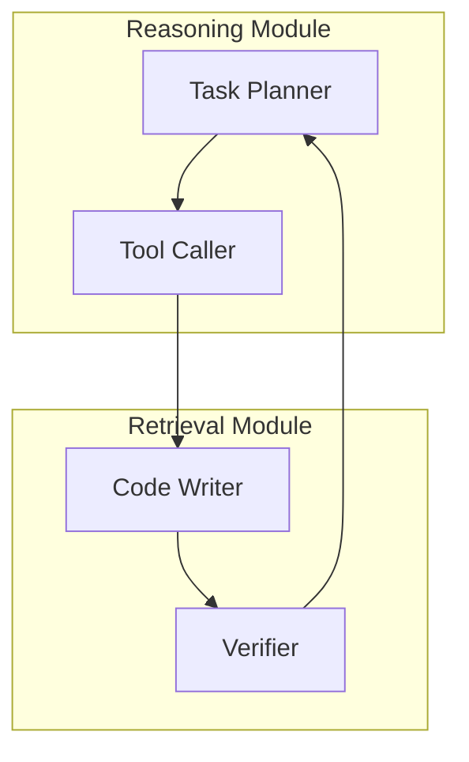

# System Patterns: SGR Architecture & Design Patterns

## Архитектурные паттерны SGR

### 1. Schema-Guided Reasoning Core Pattern

#### Структура основного паттерна
```python
class NextStep(BaseModel):
    # Chain of Thought components
    reasoning_steps: List[str]          # Пошаговое мышление
    current_situation: str              # Анализ ситуации
    
    # State tracking  
    searches_done: int                  # Progress counter
    enough_data: bool                   # Completion signal
    
    # Dynamic routing
    function: Union[Tool1, Tool2, ...]  # Следующий инструмент
```

#### Принципы применения
- **Reasoning transparency**: Каждый шаг мышления записывается в reasoning_steps
- **State awareness**: Система отслеживает прогресс через counters
- **Dynamic dispatch**: function поле определяет следующее действие
- **Type safety**: Union types ограничивают возможные действия

### 2. Multi-Agent Coordination Pattern (SG²)

#### Архитектура SG² системы


#### Разделение ответственности
**Reasoning Module:**
- **Task Planner**: Формирует высокоуровневые запросы на извлечение
- **Tool Caller**: Генерирует конкретные вызовы инструментов

**Retrieval Module:**
- **Code Writer**: Создает Python код для обхода графов
- **Verifier**: Проверяет соответствие результатов требованиям

#### Преимущества архитектуры
- **Context separation**: Каждый агент работает с минимальным контекстом
- **Specialization**: Узкая специализация улучшает качество
- **Scalability**: Легко добавлять новых агентов

### 3. Adaptive Planning Pattern

#### Структура адаптивного планирования
```python
class AdaptPlan(BaseModel):
    reasoning: str                      # Причина адаптации
    original_goal: str                  # Исходная цель
    new_goal: str                       # Обновленная цель  
    plan_changes: List[str]             # Конкретные изменения
    next_steps: List[str]               # Новые шаги
```

#### Триггеры адаптации
1. **Conflict detection**: Новые данные противоречат плану
2. **Scope expansion**: Обнаружение новых аспектов проблемы
3. **Resource constraints**: Изменение доступных ресурсов
4. **Goal refinement**: Уточнение требований от пользователя

#### Реализация в коде
```python
# Context modification
if context.get("plan"):
    context["plan"]["research_goal"] = cmd.new_goal
    context["plan"]["planned_steps"] = cmd.next_steps
    context["plan"]["adapted"] = True
```

### 4. Anti-Cycling Mechanisms

#### Проблема зацикливания
LLM могут "застревать" в повторяющихся действиях без external constraints.

#### Решения на уровне схемы
```python
class NextStep(BaseModel):
    # Progress tracking
    searches_done: int = Field(description="MAX 3-4 searches")
    enough_data: bool = Field(description="Force completion signal")
    
    # State flags  
    task_completed: bool
```

#### Anti-cycling в CONTEXT
```python
CONTEXT = {
    "clarification_used": False,  # Prevent multiple clarifications
    "searches": [],               # Search history tracking
    "citation_counter": 0         # Prevent duplicate citations
}
```

#### Forced progression logic
```python
# Auto-complete after report creation
if isinstance(job.function, CreateReport):
    print("Auto-completing after report creation")
    break
    
# Prevent clarification cycling  
if isinstance(job.function, Clarification) and CONTEXT["clarification_used"]:
    print("Clarification cycling detected - forcing continuation")
    continue
```

### 5. Citation Management Pattern

#### Automatic citation tracking
```python
def add_citation(url: str, title: str = "") -> int:
    """Centralized citation management"""
    if url in CONTEXT["sources"]:
        return CONTEXT["sources"][url]["number"]
    
    CONTEXT["citation_counter"] += 1
    number = CONTEXT["citation_counter"]
    
    CONTEXT["sources"][url] = {
        "number": number,
        "title": title, 
        "url": url
    }
    return number
```

#### Benefits
- **Deduplication**: Same source gets same citation number
- **Consistency**: Sequential numbering [1], [2], [3]
- **Traceability**: Full source information preserved

### 6. Language Consistency Pattern

#### Multi-language support strategy
```python
def get_system_prompt(user_request: str) -> str:
    return f"""
    USER REQUEST EXAMPLE: "{user_request}"
    ↑ IMPORTANT: Detect language and use THE SAME LANGUAGE
    """
```

#### Implementation в схемах
```python
class CreateReport(BaseModel):
    user_request_language_reference: str = Field(
        description="Copy of original request for language consistency"
    )
    content: str = Field(description="""
    WRITE ENTIRELY IN THE SAME LANGUAGE as user_request_language_reference
    """)
```

#### Language enforcement mechanisms
- **Reference preservation**: Оригинальный запрос сохраняется как эталон
- **Explicit instructions**: Четкие требования к языку в prompts
- **Validation**: Проверка соответствия языка в output

## Design Patterns для конкретных задач

### 7. Research Workflow Pattern

#### Cascade sequence for research
```python
# Step sequence
Clarification → GeneratePlan → WebSearch → AdaptPlan → CreateReport → ReportCompletion
```

#### State transitions
```python
def execute_research_task(task: str):
    for i in range(MAX_STEPS):
        # Get next action via SGR
        job = llm.complete(NextStep, messages)
        
        # Execute action
        result = dispatch(job.function, CONTEXT)
        
        # Check termination conditions
        if job.task_completed:
            break
```

### 8. Error Recovery Pattern  

#### Graceful degradation
```python
try:
    completion = client.beta.chat.completions.parse(...)
    job = completion.choices[0].message.parsed
    
    if job is None:
        print("Failed to parse LLM response") 
        break
        
except Exception as e:
    print(f"LLM request error: {e}")
    break
```

#### Fallback strategies
- **Partial results**: Continue с available data
- **User intervention**: Ask for clarification on errors
- **Retry logic**: Limited attempts with backoff

### 9. Context Management Pattern

#### Memory hierarchy
```python
# Session memory (volatile)
CONTEXT = {
    "plan": None,           # Current execution state
    "searches": [],         # Immediate history
    "sources": {}          # Session citations
}

# Persistent memory (Memory Bank)  
memory/memory-bank/        # Project knowledge
memory/rules/             # Learning patterns
```

#### Context optimization
- **Relevance filtering**: Только нужная информация в prompts
- **Size management**: Truncation для больших результатов
- **State consistency**: Синхронизация между компонентами

## Качественные характеристики архитектуры

### Reliability
- **95%+ reproducibility** через schema constraints
- **Deterministic routing** via explicit condition checking  
- **State validation** на каждом шаге

### Maintainability
- **Schema versioning**: Изменения без breaking changes
- **Clear separation**: Модули с четкими интерфейсами
- **Debug visibility**: Полная трассировка действий

### Extensibility  
- **Plugin architecture**: Новые tools через Union extension
- **Agent addition**: Легкое добавление specialized agents
- **Domain adaptation**: Schema customization для specific domains

### Performance
- **Lazy evaluation**: Информация извлекается по требованию
- **Context efficiency**: Минимальный необходимый контекст
- **Parallel potential**: Agents могут работать concurrently

## Антипаттерны и их избегание

### ❌ Schema Overengineering
```python
# Плохо: излишне сложная схема
class OverComplexStep(BaseModel):
    meta_reasoning_about_reasoning: str
    reasoning_confidence_metrics: Dict[str, float]
    alternative_reasoning_paths: List[ComplexPath]
```

### ✅ Optimal Schema Design  
```python
# Хорошо: простая, эффективная схема
class NextStep(BaseModel):
    reasoning_steps: List[str]      # Простое объяснение
    current_situation: str          # Краткий анализ
    function: Union[Tool1, Tool2]   # Четкое действие
```

### ❌ Context Pollution
```python
# Плохо: весь контекст в каждом запросе
messages.append({"content": full_search_history + all_sources + debug_info})
```

### ✅ Clean Context Management
```python  
# Хорошо: только релевантная информация
if CONTEXT["sources"]:
    sources_info = format_sources_for_citation()
    messages.append({"content": sources_info})
```

**Дата создания**: 2025-09-05  
**Архитектурная версия**: SGR 2.0 + SG² Multi-Agent Extensions