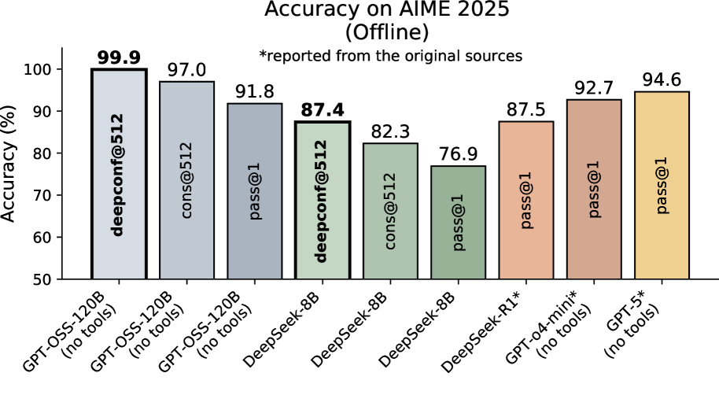
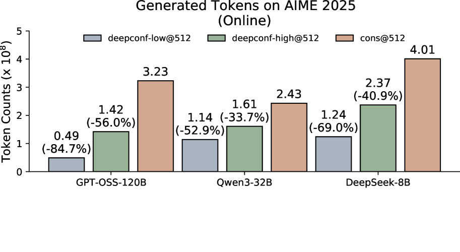
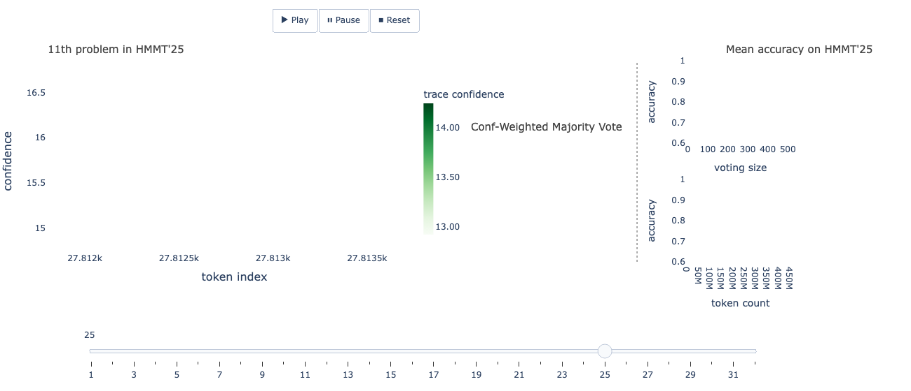
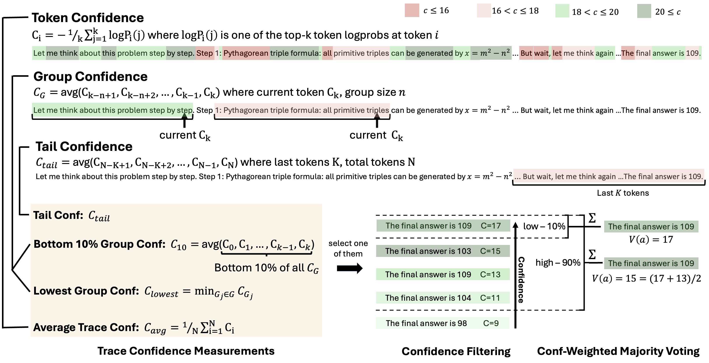

# Deep Think with Confidence (DeepConf): Confident Reasoning with Early Stopping 🚀

[](https://arxiv.org/abs/2508.15260)

## 📝 Description

This week we examine Deep Think with Confidence (**DeepConf**), an LLM reasoning methodology that measures the model's local confidence during generation to enable early stopping of low-quality traces and confidence-weighted offline answer aggregation. DeepConf requires no model retraining and seamlessly integrates into existing inference stacks, simultaneously:

- Improving accuracy on challenging benchmarks (up to **99.9%** on AIME 2025 with GPT‑OSS‑120B),
- Significantly reducing computation via early pruning of poor reasoning chains (up to **−84.7%** tokens).

## 🔍 Key Features

- **Local confidence metrics**: Sliding token windows (e.g., 1024–2048), bottom-10% metrics, minimum window confidence, tail confidence of final steps.
- **Two modes**: Offline filtering and weighted voting; online early stopping with dynamic thresholds.
- **Dynamic calibration**: "Warmup" on a small batch of traces to tune thresholds for the specific task.
- **Confidence-weighted aggregation**: Answers receive weights proportional to the confidence of their corresponding traces.
- **Training-free**: Requires no training or fine-tuning; modifications are limited to serving (logprobs, confidence window, stop conditions).
- **Integration**: Compatible with popular stack libraries (e.g., vLLM) and parallel thinking workflows.

## 📈 Results and Impact

- **Accuracy**: Outperforms majority vote; on AIME 2025 with cons@512, achieves up to **99.9%** (GPT‑OSS‑120B).
- **Efficiency**: Token reduction of **−43…−85%** (DeepConf-low) and **−18…−59%** (DeepConf-high) with comparable or superior accuracy.
- **Stability**: Confidence reliably separates "successful" from "unsuccessful" traces, enabling systematic noise filtering.




## 🧠 How DeepConf Works (Briefly)

- **Confidence estimation during generation**: Aggregated over sliding token windows; multiple metric variants available (min, bottom-10%, tail).
- **Online stop**: Thresholds `s_low`/`s_high` are set after "warmup" and halt low-confidence traces in real time.
- **Offline filtering**: Only the top-η% traces by confidence are retained before voting.
- **Weighted voting**: Answers are aggregated with weights dependent on trace confidence.




## 🌟 Practical Applications

- Mathematical and logical benchmarks (AIME 2024/2025, BRUMO25, HMMT25).
- Systems using parallel thinking: Reduce costs without sacrificing quality.
- Production reasoning pipelines: Predictability, reproducibility, and control over computational budgets.

## 📜 Citation

```bibtex
@misc{fu2025deepthinkconfidence,
  title        = {Deep Think with Confidence},
  author       = {Yichao Fu and Xuewei Wang and Yuandong Tian and Jiawei Zhao},
  year         = {2025},
  eprint       = {2508.15260},
  archivePrefix= {arXiv},
  primaryClass = {cs.LG},
  url          = {https://arxiv.org/abs/2508.15260},
}
```

---

<div align="center">

**Explore with us 🚀**

⭐ Star this repository if you found it helpful

</div>