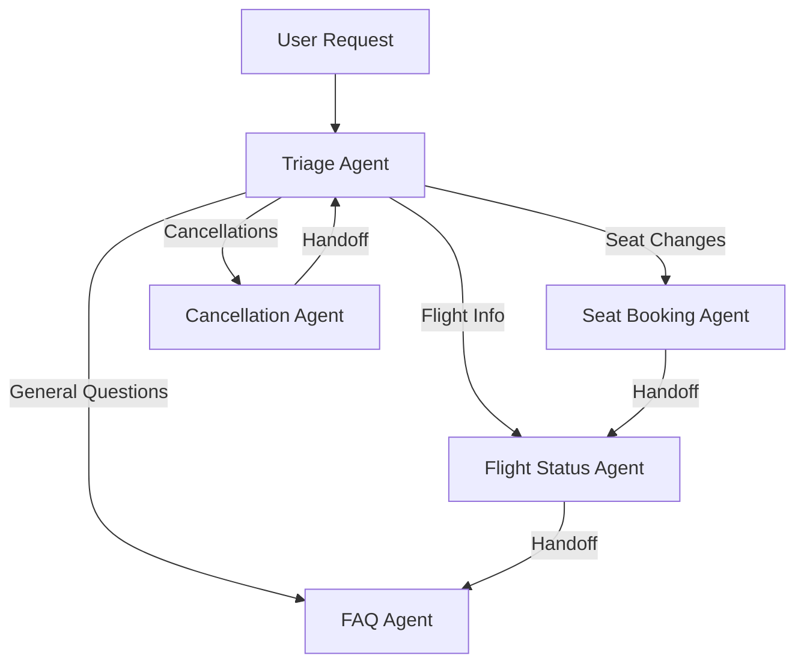

# System Patterns - Customer Service Agents Demo

## Архитектурные паттерны

### 1. Multi-Agent Orchestration Pattern



**Принципы**:
- Единая точка входа через Triage Agent
- Специализация агентов по функциональным доменам
- Возможность передачи управления между агентами
- Сохранение контекста при handoff

### 2. State Management Pattern

```python
# Структура состояния беседы
{
    "input_items": [          # История сообщений
        {"content": "...", "role": "user"},
        {"content": "...", "role": "assistant"}
    ],
    "context": {             # Контекст беседы
        "confirmation_number": "LL0EZ6",
        "flight_number": "FLT-123",
        "current_seat": "12A"
    },
    "current_agent": "triage_agent"  # Активный агент
}
```

**Принципы**:
- Centralized state в conversation store
- Immutable context updates
- Agent-agnostic state structure
- Event-driven state changes

### 3. Guardrails Pattern

```python
@agent.input_guardrail
def relevance_guardrail(message: str) -> GuardrailResult:
    # Проверка релевантности запроса
    if not is_airline_related(message):
        return GuardrailResult(
            passed=False,
            reason="Request not related to airline services"
        )
    return GuardrailResult(passed=True)
```

**Принципы**:
- Проактивная фильтрация входных данных
- Композиция guardrails для разных типов защиты
- Визуальная индикация срабатывания в UI
- Graceful degradation при срабатывании

### 4. Event-Driven Communication Pattern

```typescript
interface AgentEvent {
    id: string;
    type: 'message' | 'handoff' | 'tool_call' | 'guardrail';
    agent: string;
    content: string;
    metadata?: Record<string, any>;
    timestamp: number;
}
```

**Принципы**:
- Structured event emission от агентов
- Real-time UI updates на основе событий
- Event persistence для debugging
- Typed event interfaces

## Ключевые паттерны кодирования

### 1. Agent Definition Pattern

```python
from agents import Agent, Handoff

agent = Agent(
    name="specific_agent",
    instructions="Detailed instructions for the agent",
    tools=[tool1, tool2],
    handoffs=[
        Handoff(
            agent_name="target_agent",
            handoff_description="When to handoff"
        )
    ],
    input_guardrails=[guardrail1, guardrail2]
)
```

### 2. Tool Definition Pattern

```python
from pydantic import BaseModel

class ToolInput(BaseModel):
    parameter: str

def tool_function(input: ToolInput) -> str:
    """Tool description for the agent"""
    # Tool implementation
    return result
```

### 3. Context Propagation Pattern

```python
# Контекст передается через все вызовы
result = await Runner.run(
    agent=current_agent,
    input_items=state["input_items"],
    context=state["context"]  # Ключевой элемент
)
```

### 4. Error Handling Pattern

```python
try:
    result = await Runner.run(agent, input_items, context=context)
except InputGuardrailTripwireTriggered as e:
    # Обработка срабатывания guardrail
    return handle_guardrail_violation(e)
except Exception as e:
    # Обработка других ошибок
    return handle_generic_error(e)
```

## UI/UX Patterns

### 1. Real-time Agent Visualization

```typescript
const AgentPanel = ({ currentAgent, agents }) => {
  return (
    <div className="agent-grid">
      {agents.map(agent => (
        <AgentCard 
          key={agent.name}
          agent={agent}
          isActive={agent.name === currentAgent}
        />
      ))}
    </div>
  );
};
```

### 2. Guardrails Indicator Pattern

```typescript
const GuardrailIndicator = ({ guardrail }) => {
  const statusColor = guardrail.passed ? 'green' : 'red';
  return (
    <Badge variant={statusColor}>
      {guardrail.name}: {guardrail.passed ? 'PASSED' : 'FAILED'}
    </Badge>
  );
};
```

### 3. Event Stream Display

```typescript
const RunnerOutput = ({ events }) => {
  return (
    <ScrollArea>
      {events.map(event => (
        <EventItem key={event.id} event={event} />
      ))}
    </ScrollArea>
  );
};
```

## Anti-patterns и их избежание

### ❌ Direct Agent-to-Agent Communication
```python
# Неправильно - прямое взаимодействие
seat_agent.call_flight_agent(request)
```

### ✅ Orchestrated Handoffs
```python
# Правильно - через Runner и Handoff
return Handoff(
    agent_name="flight_status_agent",
    handoff_description="User needs flight information"
)
```

### ❌ Shared Mutable State
```python
# Неправильно - изменяемое состояние
global_context.update({"key": "value"})
```

### ✅ Immutable Context Updates
```python
# Правильно - создание новых объектов
new_context = context.model_copy(update={"key": "value"})
```

### ❌ Blocking UI Operations
```typescript
// Неправильно - блокирующие операции
const response = await fetch('/api/chat');
setLoading(false);
```

### ✅ Optimistic Updates
```typescript
// Правильно - оптимистичные обновления
setMessages(prev => [...prev, userMessage]);
const response = await fetch('/api/chat');
```

## Масштабируемость и производительность

### 1. State Partitioning
- Разделение состояния по conversation_id
- Независимые обновления для разных бесед
- Возможность шардинга по пользователям

### 2. Agent Caching
- Кеширование инициализированных агентов
- Переиспользование tool instances
- Lazy loading для редко используемых агентов

### 3. Event Batching
- Группировка событий для UI updates
- Debouncing для частых изменений
- Efficient DOM updates через React batching 